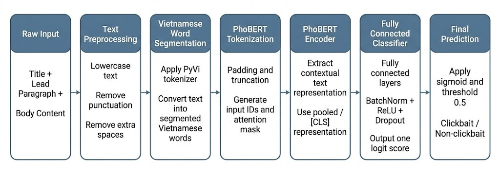
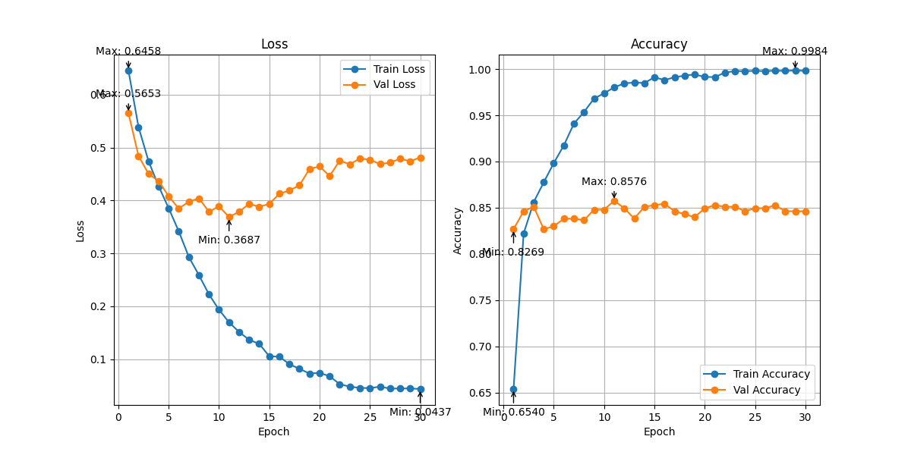
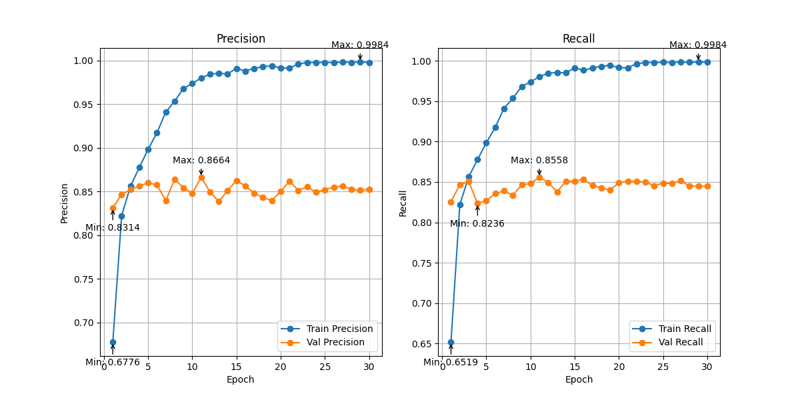
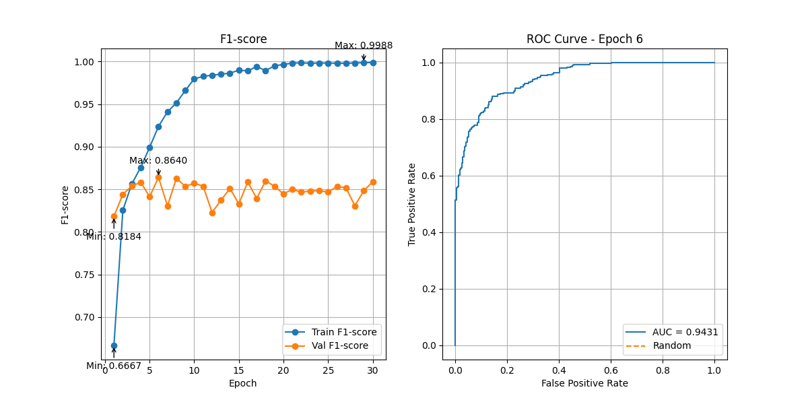
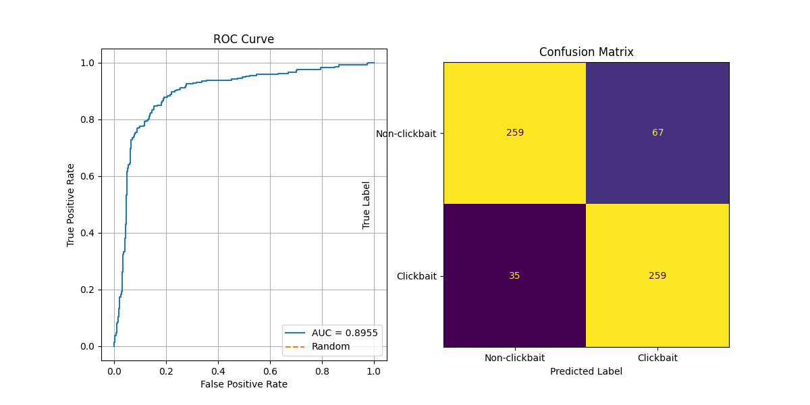

# Vietnamese Clickbait Detection

This project detects whether a Vietnamese news headline or article is
**clickbait** or **non-clickbait** using PhoBERT. The current version supports
model training, validation threshold tuning, test-set evaluation, command-line
inference, web crawling utilities, local PhoBERT model folders, and a Streamlit
app for interactive prediction.


## 1. Objective

The task is binary text classification:

```text
1 = clickbait
0 = non-clickbait
```

Main pipeline:

```text
Raw Vietnamese text
-> Text preprocessing
-> Vietnamese word segmentation with PyVi
-> PhoBERT tokenization
-> PhoBERT encoder
-> Multi-layer binary classifier
-> Clickbait probability
-> Clickbait / Non-clickbait prediction
```



## 2. Current Features

- Fine-tune PhoBERT for Vietnamese clickbait detection.
- Use PhoBERT from Hugging Face or from local folders.
- Automatically split the dataset into train, validation, and test sets.
- Use `BCEWithLogitsLoss` with `pos_weight` to reduce class imbalance impact.
- Save `best.pth` and `last.pth` model checkpoints.
- Save training history and metric plots.
- Tune the classification threshold on the validation set.
- Evaluate the selected threshold on the test set.
- Run CLI inference for a single headline.
- Run a Streamlit app with three prediction modes:
  - predict from a typed title.
  - predict from an article URL.
  - predict from a CSV or Excel file.
- Crawl Vietnamese article links and article fields.
- Download PhoBERT models locally for repeatable offline-style use.

## 3. Project Structure

```text
clickbait_detect_proj/
│
├── data/
│   ├── processed/
│   │   └── combined_dataset.csv
│   └── raw/
│       ├── train_clickbait.csv
│       ├── test_clickbait.csv
│       ├── clickbait_dataset_vietnamese.csv
│       └── val_clickbait.csv
│
├── artifacts/
│   ├── models/
│   │   ├── best.pth
│   │   └── last.pth
│   └── reports/
│       ├── history.json
│       ├── best_threshold.json
│       ├── eval_on_test_set.json
│       ├── tune_result.csv
│       ├── roc_curve_confusion_matrix.png
│       ├── precision_recall.png
│       ├── f1_roc.png
│       └── loss_acc.png
│
├── notebooks/
│   ├── download_dataset.ipynb
│   ├── eda.ipynb
│   └── process_imbalance.ipynb
│
├── src/
│   └── clickbait_detector/
│       ├── __init__.py
│       ├── clickbait_dataset.py
│       ├── preprocessing.py
│       ├── net.py
│       ├── utils.py
│       ├── crawl_data.py
│       ├── download_phobert.py
│       └── inference.py
│
├── app.py
├── train.py
├── pyproject.toml
└── README.md
```

## 4. Environment Setup

Python `>=3.10` is recommended.

Using Conda:

```bash
conda create -n clickbait_env python=3.10 -y
conda activate clickbait_env
```

Using `venv` on Windows PowerShell:

```powershell
python -m venv .venv
.\.venv\Scripts\activate
```

Using `venv` on macOS/Linux:

```bash
python -m venv .venv
source .venv/bin/activate
```

## 5. Install Dependencies

This project uses `pyproject.toml`, so install the project in editable mode:

```bash
python -m pip install -e .
```

If you also want to install development tools such as `pytest`, `black`, and `isort`, run:

```bash
python -m pip install -e ".[dev]"
```

To check whether the package is installed correctly:

```bash
python -c "import clickbait_detector; print('Import successfully')"
```

## 6. Dataset

Main processed training file:

```text
data/processed/combined_dataset.csv
```

The current processed dataset has about `6186` rows and these columns:

```text
url,title,lead_paragraph,label,body_preview,title_combined
```

Important columns:

| Column | Description |
|---|---|
| `url` | Source article URL |
| `title` | Article title |
| `lead_paragraph` | Lead paragraph or short description |
| `body_preview` | Crawled article body preview/content |
| `title_combined` | Combined training text built from title, lead, and content |
| `label` | Binary label: `1` clickbait, `0` non-clickbait |

In this project, the model is trained using a combination of the article title, lead paragraph, and body content. To construct the training dataset, we merged four available data files: `test_clickbait.csv`, `train_clickbait.csv`, `val_clickbait.csv`, and `clickbait_dataset_vietnamese.csv`. In addition, we collected more Vietnamese news articles through web crawling and manually labeled them as clickbait or non-clickbait. This additional data was used to increase the dataset size and reduce the class imbalance problem, helping the model learn more effectively from both clickbait and non-clickbait samples.

You can download `test_clickbait.csv`, `train_clickbait.csv`, `val_clickbait.csv` in download_dataset notebook, `clickbait_dataset_vietnamese.csv` in kaggle, and combine it in process_imbalance notebook. If you can't do this, you also download it at https://drive.google.com/drive/folders/1CRyXBZicxu-dxQuqzguI__TfBRe2sk6r?usp=sharing. I did it for you.


## 7. Local PhoBERT Models

To download PhoBERT from Hugging Face:

```bash
python -m clickbait_detector.download_phobert --model base-v2 --save_root ./configs
```

Other supported options:

```bash
python -m clickbait_detector.download_phobert --model base
python -m clickbait_detector.download_phobert --model base-v2
python -m clickbait_detector.download_phobert --model large
```

Custom model example:

```bash
python -m clickbait_detector.download_phobert --model custom --model_name vinai/phobert-base-v2 --save_root ./configs --save_name phobert-base-v2
```

**Downloading the model will help you avoid max retry issues when running the train or inference.**

## 8. Train the Model

Run from the project root:

```bash
python train.py --config_dir "./configs/phobert-base-v2" --data_dir "./data/processed/combined_dataset.csv" --save_path "./artifacts" --batch_size 16 --epochs 30 --max_len 256 --patience 0 --dropout 0.3
```

This command uses the learning-rate defaults in `train.py`:

```text
backbone_lr = 5e-6
classify_lr = 2e-5
```

Training arguments:

| Argument | Default | Description |
|---|---:|---|
| `--config_dir` | `vinai/phobert-base-v2` | PhoBERT model/tokenizer path or Hugging Face model name |
| `--data_dir` | `.\data\processed\combined_dataset.csv` | Training dataset path |
| `--save_path` | `.\artifacts` | Output directory for checkpoints and reports |
| `--batch_size` | `16` | Batch size |
| `--backbone_lr` | `5e-6` | Learning rate for the PhoBERT backbone |
| `--classify_lr` | `2e-5` | Learning rate for classifier layers |
| `--epochs` | `30` | Maximum number of epochs |
| `--max_len` | `256` | Maximum token length |
| `--patience` | `0` | `0` disables early stopping |
| `--dropout` | `0.3` | Classifier dropout rate |


Expected output files:

```text
artifacts/phobert-base-v2-final/models/best.pth
artifacts/phobert-base-v2-final/models/last.pth
artifacts/phobert-base-v2-final/reports/history.json
artifacts/phobert-base-v2-final/reports/best_threshold.json
artifacts/phobert-base-v2-final/reports/eval_on_test_set.json
artifacts/phobert-base-v2-final/reports/tune_result.csv
artifacts/phobert-base-v2-final/reports/loss_acc.png
artifacts/phobert-base-v2-final/reports/precision_recall.png
artifacts/phobert-base-v2-final/reports/f1_roc.png
artifacts/phobert-base-v2-final/reports/roc_curve_confusion_matrix.png
```

File meaning:
```text 
best.pth                         the best model checkpoint based on validation F1-score
last.pth                         the checkpoint from the final training epoch
history.json                     training history including train_loss, val_loss, train_acc, val_acc, precision, recall, F1-score, and validation probabilities
best_threshold.json              the best classification threshold found on the validation set
tune_result.csv                  threshold tuning results for different threshold values
eval_on_test_set.json            final evaluation metrics on the test set using the best threshold
loss_acc.png                     plot of training/validation loss and accuracy during training
precision_recall.png             plot of training/validation precision and recall during training
f1_roc.png                       plot of F1-score during training and ROC curve at the best epoch
roc_curve_confusion_matrix.png   ROC curve and confusion matrix on the test set
```

After training, run inference with the saved model checkpoint. Training might take quite a long time, and if you can't, you can download it here https://drive.google.com/drive/folders/1H1pNDpdn2ikGbwLrdz4lY6ie6qADp4zZ?usp=sharing. I did it for you.


## 9. Current Results

The best results when I tune threshold on the valid set.

| Metric |    Value |
|---|---------:|
| Best threshold |   `0.07` |
| Accuracy | `0.8608` |
| Precision | `0.8506` |
| Recall | `0.8675` |
| F1 | `0.8590` |

The results when I use best threshold on the test set.

| Metric |    Value |
|---|---------:|
| Best threshold |   `0.07` |
| Accuracy | `0.8355` |
| Precision | `0.8377` |
| Recall | `0.8377` |
| F1 | `0.8354` |

Training plots:







Test on test set with best threshold:


## 10. CLI Inference

Windows PowerShell example:

```bash
python -m clickbait_detector.inference --config_dir ".\configs\phobert-base-v2" --weight_path ".\artifacts\models\last.pth" --input_sentence "Bạn sẽ không tin điều gì đã xảy ra sau khi cô gái mở chiếc hộp bí ẩn này" --threshold 0.5 --max_len 256
```

Output format:

```text
{'Sentence': '...', 'Label': 'clickbait', 'Score': 0.7345}
```

Notes:

- Wrap the input sentence in quotes if it contains spaces.
- A lower threshold makes the model more likely to predict clickbait.
- The tuned validation threshold is currently `0.1`, while `app.py` uses `0.5`.

## 11. Streamlit App

Run the app:

```bash
streamlit run app.py
```

Current app defaults:

```text
config_dir  = .\configs\phobert-base-v2
weight_path = .\artifacts\models\last.pth
max_len     = 256
threshold   = 0.5
```

Available tabs:

| Tab | Description |
|---|---|
| `Predict from Title` | Type one title and predict directly |
| `Predict from URL` | Enter an article URL, crawl its title, then predict |
| `Predict from CSV` | Upload a `.csv` or `.xlsx` file and predict all rows |

Input file format for CSV/Excel prediction:

```csv
title
"You will not believe what happened after the secret box was opened"
"The government announced a new urban transport upgrade plan"
```

The uploaded file must contain a `title` column.


## 12. Python Imports

After installing the project:

```bash
python -m pip install -e .
```

Use:

```python
from clickbait_detector import (
    ClickBaitDataset,
    Model,
    create_data_split,
    create_dataloader,
    train,
    tune_threshold,
    evaluate_on_test_set,
    show_results,
)
```

Avoid:

```python
from src.clickbait_detector import Model
```

The correct package name is:

```text
clickbait_detector
```


